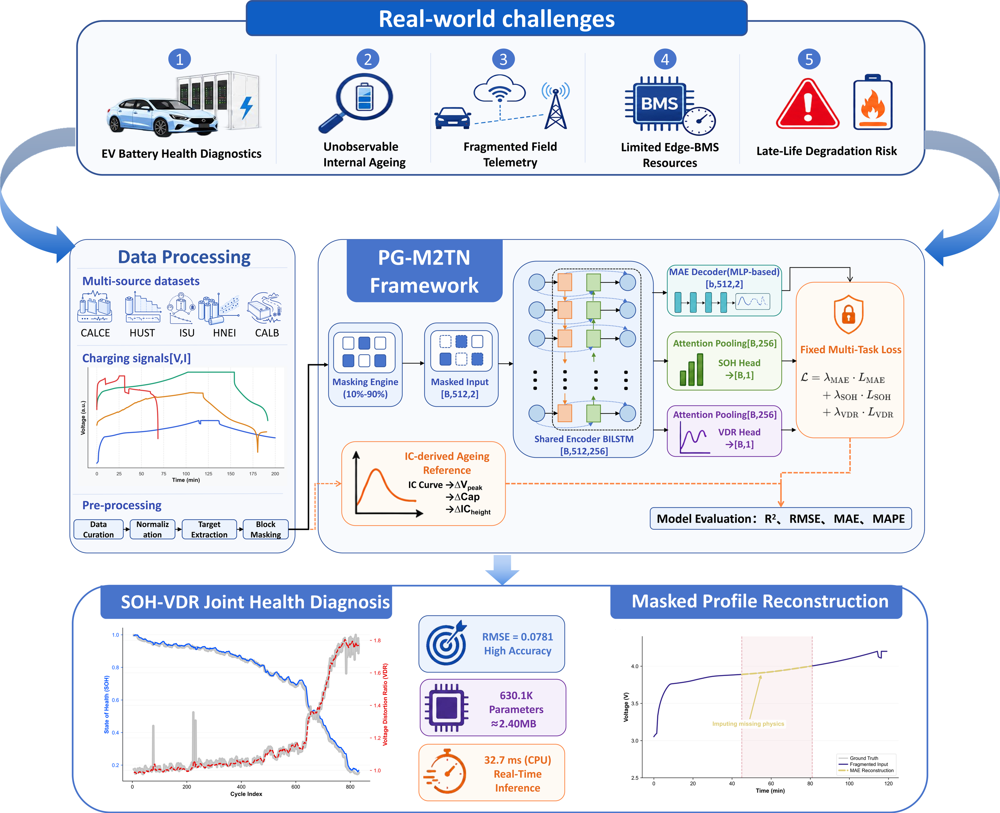

# PG-M2TN



Official implementation of **Physics-Guided Masked Multi-Task Network for Edge-Friendly Battery Health Diagnostics from Stochastically Fragmented Charging Profiles**.

PG-M2TN estimates battery state of health (SOH) from incomplete charging profiles. The method combines masked profile reconstruction, SOH regression, and voltage-dispersion-rate (VDR) prediction in one compact network. This repository contains the PG-M2TN model, its training and evaluation pipeline, and the exact ablation configurations used to study its components.

## What We Study

Battery-health models are commonly evaluated using complete and regularly sampled cycling records. Real charging observations may instead be interrupted by charger disconnection, communication loss, or partial data collection. Missing continuous regions can remove diagnostically useful voltage and current evolution and make SOH estimation less reliable.

We study whether a compact model can learn useful battery-health representations directly from stochastically fragmented charging profiles. PG-M2TN addresses this problem through three related objectives:

1. **SOH estimation** learns the primary battery-health target.
2. **Masked reconstruction** encourages the shared encoder to recover information removed from continuous profile regions.
3. **VDR prediction** supplies an auxiliary charge-curve descriptor associated with voltage dispersion during charging.

VDR is derived from the charging profile and used as a fixed-weight auxiliary target rather than an inference input. It introduces charge-curve information into representation learning while keeping the model independent of battery-specific electrochemical equation parameters.

## Main Findings

- Fragmented voltage-current sequences can be processed directly without requiring a complete charging curve at inference time.
- Joint reconstruction and health-related supervision provide a practical way to learn from continuous missing regions.
- A two-layer PG-M2TN with hidden size `128` contains `630,149` parameters, supporting the study's efficiency-oriented design objective.
- The influence of MAE and VDR supervision is dataset-dependent. The ablations are therefore reported separately rather than used to claim that either auxiliary task universally improves pooled SOH error.
- Fixed task coefficients make the contribution of each learning objective explicit and reproducible.

## Results

PG-M2TN was evaluated on a held-out, cell-level test partition covering CALCE, HUST, HNEI, CALB, and ISU-ILCC. Model selection used validation SOH RMSE only; the test partition was not used to choose the checkpoint.

| Configuration | Parameters | Best epoch | Validation SOH RMSE | Test SOH RMSE | Test SOH MAE | Test SOH R2 |
|---|---:|---:|---:|---:|---:|---:|
| PG-M2TN-128 | 630,149 | 98 | 0.040604 | 0.089500 | 0.046316 | 0.943954 |

The exact PG component ablations produced:

| Configuration | SOH weight | VDR weight | MAE weight | Best epoch | Test SOH RMSE | Test SOH MAE | Test SOH R2 |
|---|---:|---:|---:|---:|---:|---:|---:|
| `full` | 0.50 | 0.50 | 0.10 | 98 | 0.089500 | 0.046316 | 0.943954 |
| `no_mae` | 0.50 | 0.50 | 0.00 | 83 | 0.110127 | 0.053817 | 0.915143 |
| `no_vdr` | 0.50 | 0.00 | 0.10 | 61 | 0.089429 | 0.049512 | 0.944043 |
| `soh_only` | 0.50 | 0.00 | 0.00 | 74 | 0.072608 | 0.042413 | 0.963113 |

These configurations isolate the contribution of each PG-M2TN objective. The full model jointly supports SOH estimation, VDR prediction, and masked-profile reconstruction, while the ablations expose the resulting accuracy and representation trade-offs. Small numerical variation can occur across CUDA and cuDNN versions.

## Why It Matters

The work targets a practical gap between complete-profile laboratory evaluation and incomplete charging observations. PG-M2TN shows how a charge-curve descriptor and masked reconstruction can be incorporated into a compact, reproducible multi-task architecture.

This design supports three practical goals:

- diagnosing battery health when continuous parts of a charging record are unavailable;
- retaining a small fixed architecture suitable for subsequent embedded deployment studies;
- separating model training from post-hoc physical interpretation so that each claim can be evaluated independently.

## Repository Layout

```text
PG-M2TN/
|-- pg_m2tn/
|   |-- data/
|   |   |-- dataset_loader.py   # charge extraction, normalization, cell split
|   |   `-- masking_engine.py   # random and fixed-seed block masking
|   |-- models/
|   |   |-- pg_m2tn.py          # PG-M2TN-128 architecture
|   |   `-- loss.py             # fixed SOH/VDR/MAE objective
|   |-- evaluation.py           # pooled and dataset-wise metrics
|   |-- protocol.py             # experiment constants and ablations
|   `-- utils/metrics.py
|-- scripts/
|   |-- train.py                # main and ablation training
|   |-- evaluate.py             # held-out fixed-test evaluation
|   `-- run_ablation.sh         # sequential four-variant launcher
|-- tests/test_smoke.py
|-- CHANGELOG.md
|-- requirements.txt
`-- setup.py
```

Baseline implementations, manuscript plotting utilities, server orchestration scripts, datasets, and trained checkpoints are not included.

## Environment

The reported experiments used:

```text
Python 3.11.10
PyTorch 2.5.1 + CUDA 12.1
NumPy 2.4.6
tqdm 4.68.4
```

Create the environment and verify the package:

```bash
python3.11 -m venv .venv
source .venv/bin/activate
pip install -r requirements.txt
pip install -e .
python -m unittest discover -s tests -v
```

Install the CUDA 12.1 build of PyTorch when reproducing the reported GPU environment.

## Data

Prepare the five unified datasets under one root:

```text
battery_data/
|-- CALCE/*.pkl
|-- HUST/*.pkl
|-- HNEI/*.pkl
|-- CALB/*.pkl
`-- ISU_ILCC/*.pkl
```

Each file stores one cell:

```python
{
    "cell_id": "CS2_35",
    "nominal_capacity_in_Ah": 1.1,
    "cathode_material": "LCO",  # optional
    "cycle_data": [
        {
            "voltage_in_V": numpy_array,
            "current_in_A": numpy_array,
            "charge_capacity_in_Ah": numpy_array,
            "discharge_capacity_in_Ah": numpy_array,
        },
    ],
}
```

The evaluated data snapshot contains `753,646` usable charge-only cycle samples from `274` cells:

| Partition | Cells | Cycle samples |
|---|---:|---:|
| Train | 189 | 542,831 |
| Validation | 39 | 84,413 |
| Test | 46 | 126,402 |

Cells are split within each source dataset using a `70/15/15` target ratio and seed `42`. Cycles from the same cell never cross partitions. Per-dataset train/validation/test cell counts are CALCE `9/1/3`, HUST `53/11/13`, HNEI `9/2/3`, CALB `18/4/5`, and ISU-ILCC `100/21/22`.

## Reproduction

### 1. Install

```bash
git clone https://github.com/shuhaochen618-svg/PG-M2TN.git
cd PG-M2TN
pip install -r requirements.txt
pip install -e .
```

### 2. Prepare the data

Place CALCE, HUST, HNEI, CALB, and ISU-ILCC under one data root using the directory structure shown above.

### 3. Train PG-M2TN-128

```bash
CUDA_VISIBLE_DEVICES=0,1,2,3,4,5,6,7 \
python scripts/train.py \
    --data_root /path/to/battery_data \
    --variant full \
    --output_dir outputs/pg_m2tn
```

The script uses the reported model settings, cell split, masking seeds, and fixed loss weights by default. The best checkpoint is selected using validation SOH RMSE.

### 4. Run the ablations

```bash
bash scripts/run_ablation.sh /path/to/battery_data outputs/pg_m2tn
```

This runs `full`, `no_mae`, `no_vdr`, and `soh_only` sequentially.

### 5. Evaluate

```bash
python scripts/evaluate.py \
    --checkpoint outputs/pg_m2tn/full/best.pt \
    --data_root /path/to/battery_data \
    --output outputs/pg_m2tn/full/evaluation.json
```

Training results, per-dataset metrics, and split information are saved under `outputs/pg_m2tn/<variant>/`.
